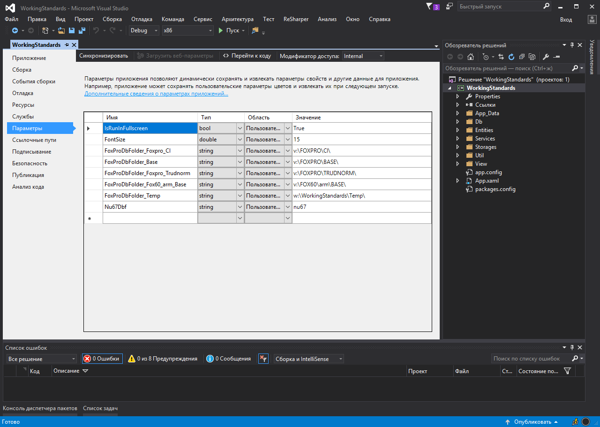
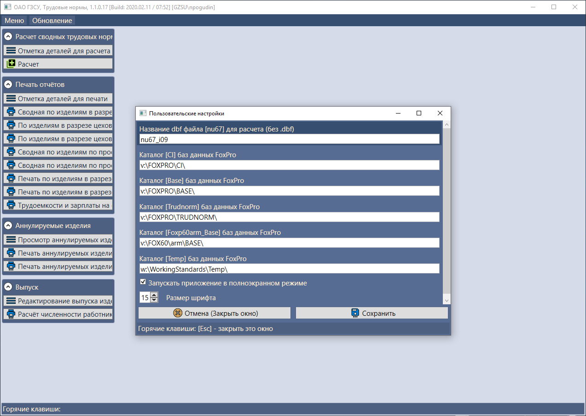
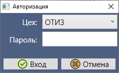
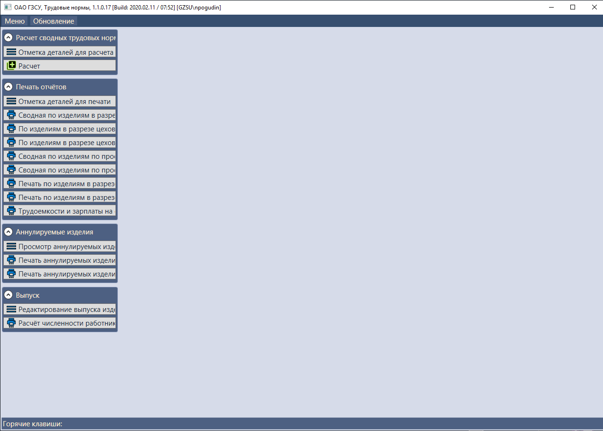
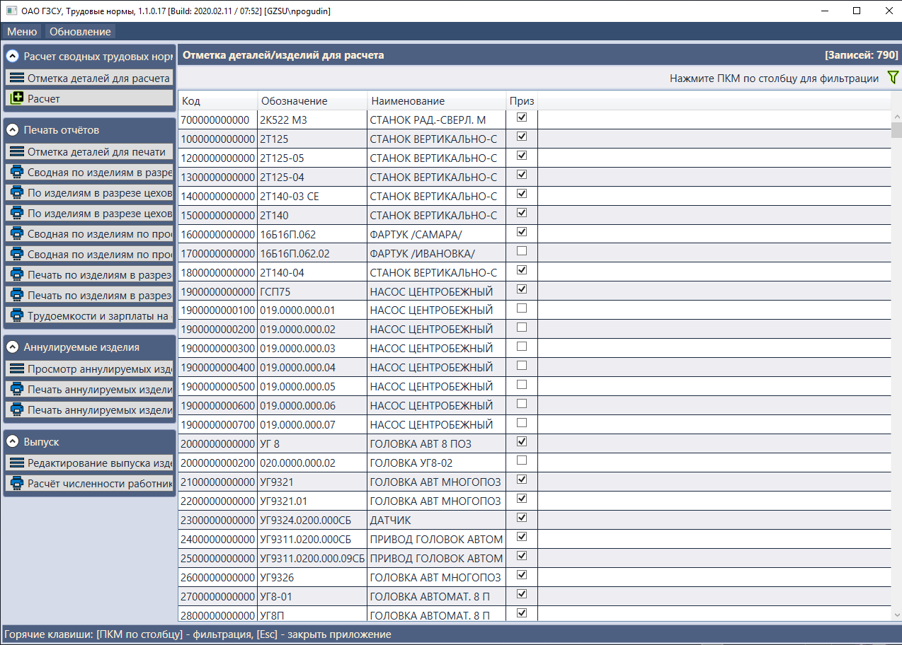
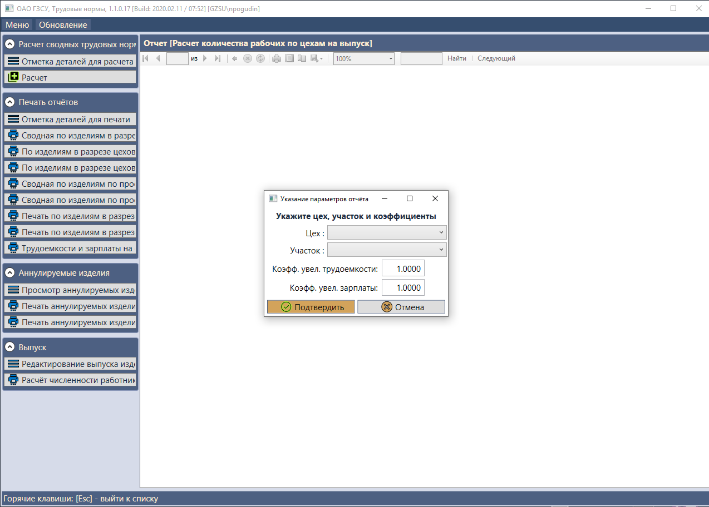
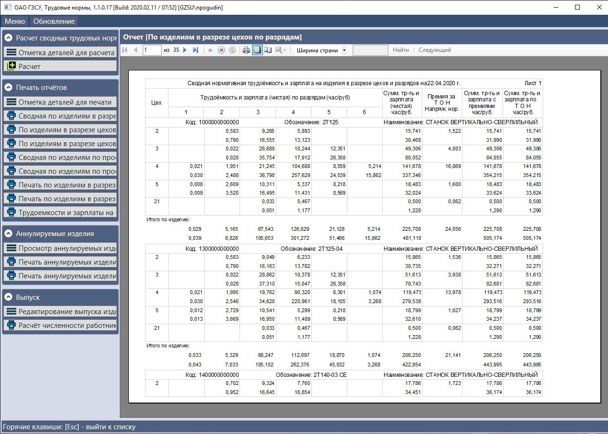

# WorkingStandards

Рабочее название: *WorkingStandards*  
Приложение **АРМ WorkingStandards** - десктоп-приложение для отдела ОТИЗ. Предназначено для расчета трудовых нормативов предприятия, а так же получения соответствующих отчетов.

### Требуемые DBF базы предприятия: 
- Таблица для расчета трудовых нормативов [nu67.dbf]
- Таблица трудовых нормативов [Advx03.dbf]
- Таблица логинов, паролей и прав доступа к приложению [WorkingStandardsPassword.dbf] 
- Таблица выпускаемых изделий [izd_rasc.dbf]
- Таблица аннулируемых изделий [anul67.dbf]

### Параметры инициализации в IDE  
Параметры инициализации проекта на каждой машине разработчика (все файлы настроек описаны в .gitignore, дабы не перезатирать при каждом коммите): 

Параметр | Тип | Значение | Комментарий 
-------- | --- | -------- | -----------
IsRunInFullscreen               | bool   | True                 		| Признак запуска приложения в полноэкранном режиме 
FontSize               			| double | 15                   		| Размер шрифта
FoxproDbFolder_Foxpro_CI  		| string | v:\FOXPRO\CI\   				| Путь до dbf таблиц аннулированных изделий
FoxProDbFolder_Base  			| string | v:\FOXPRO\BASE\   			| Путь до dbf таблиц foxpro базовых
FoxProDbFolder_Foxpro_Trudnorm  | string | v:\FOXPRO\TRUDNORM\			| Путь до dbf таблиц где хранятся расчитанные трудовые нормативы
FoxproDbFolder_Fox60_Arm_Base  	| string | v:\FOX60\arm\BASE\   		| Путь до dbf таблиц fox60 базовых
FoxProDbFolder_Temp             | string | w:\WorkingStandards\Temp\    | Путь до временных файлов приложения, необходимых при расчете
Nu67Dbf							| string | nu67    						| Название таблицы трудовых нормативов

### Скриншоты окна настроек и рабочего приложения  

  

  

  

  

  

  

  
